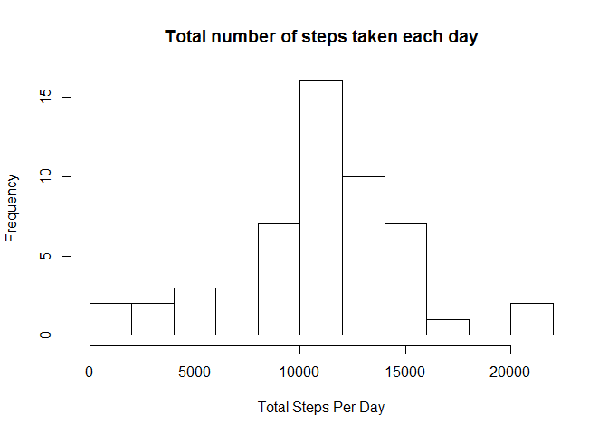
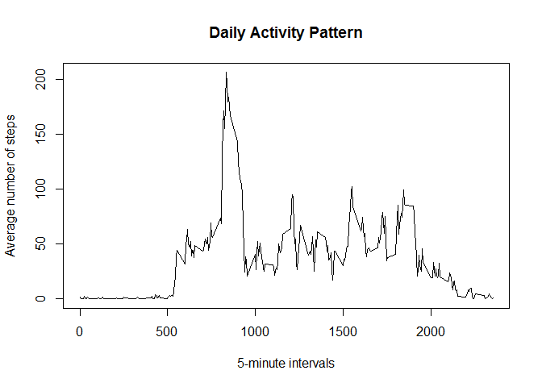
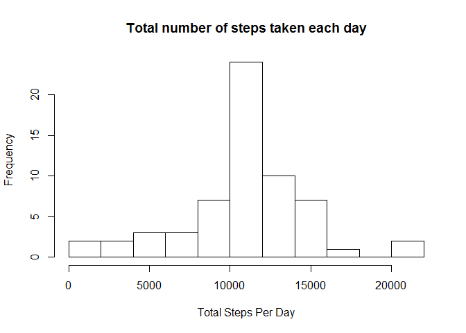
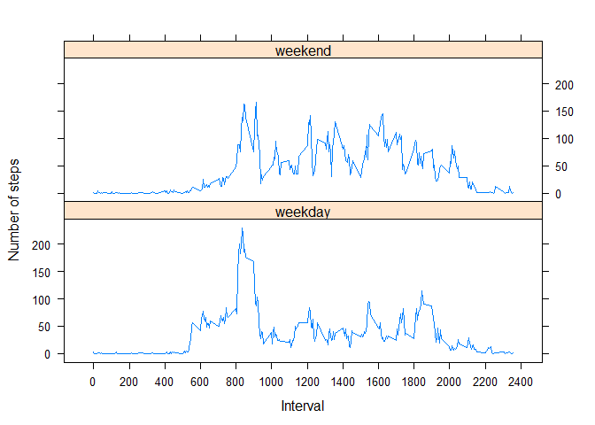

# Reproducible Research: Peer Assessment 1


## Loading and preprocessing the data

```r
activity <- read.csv("activity.csv", stringsAsFactors = FALSE)
activity$datetime <- with(activity, 
                          as.POSIXct(date, format = "%Y-%m-%d") 
                          + (interval * 60))
```


## What is mean total number of steps taken per day?

```r
stepsPerDay <- tapply(activity$steps[!is.na(activity$steps)],
                activity$date[!is.na(activity$steps)], sum)

hist(stepsPerDay, breaks = 10, xlab = "Total Steps Per Day",
     main = "Total number of steps taken each day")
```

 

```r
mean(stepsPerDay)
```

```
## [1] 10766.19
```

```r
median(stepsPerDay)
```

```
## [1] 10765
```


## What is the average daily activity pattern?

```r
avSteps <- tapply(activity$steps[!is.na(activity$steps)],
                  activity$interval[!is.na(activity$steps)],mean)

xAxis <- unique(activity$interval)

plot(xAxis, avSteps, main = "Daily Activity Pattern", 
     xlab = "5-minute intervals", ylab = "Average number of steps",
     type = "l")
```

 

```r
mInterval <- as.numeric(names(which.max(avSteps)))
```
5 minute interval that contains the maximum number of steps on average across 
all days is 


```
## [1] 835
```


## Imputing missing values
Total number of of missing values in the dataset

```r
sum(!complete.cases(activity))
```

```
## [1] 2304
```

Since the values are missing not for random 5 minute intervals but for the whole 
days, let's populate the missing values with the rounded averages across all 
days for the correspoinding intervals


```r
activityFull <- activity
activityFull$steps[is.na(activity$steps)] <- 
        with(activity[is.na(activity$steps),], 
                round(avSteps[as.character(interval)])
             )
```

A histogram of the total number of steps taken each day for the fully populated 
dataset  


```r
stepsPerDayFull <- tapply(activityFull$steps, activity$date, sum) 

hist(stepsPerDayFull, breaks = 10, xlab = "Total Steps Per Day",
     main = "Total number of steps taken each day")
```

 
  
Mean total number of steps taken per day.

```r
mean(stepsPerDayFull)
```

```
## [1] 10765.64
```
Median total number of steps taken per day.

```r
median(stepsPerDayFull)
```

```
## [1] 10762
```
  
As we can see, for the original dataset the values of mean and median total 
number of steps per day (10766.19 and 
10765 respectively) are greater than 
the same for the dataset with populated missing values 
(10765.64 and 
10762)

## Are there differences in activity patterns between weekdays and weekends?

```r
activityFull$daytype <- weekdays(as.Date(activity$date))

activityFull$daytype[activityFull$daytype %in% c("Monday", "Tuesday", 
                                                 "Wednesday", "Thursday", 
                                                 "Friday")
                     ] <- "weekday"

activityFull$daytype[activityFull$daytype != "weekday"] <- "weekend"

activityFull$daytype <- factor(activityFull$daytype, 
                               levels = c("weekday", "weekend"), 
                               labels=c("weekday", "weekend"))

avStepsDayType <- tapply(activityFull$steps, 
                         list(activityFull$interval, activityFull$daytype), 
                         mean)

avStepsDayType <- as.data.frame(as.table(avStepsDayType))

names(avStepsDayType) <- c("interval","daytype","steps")

avStepsDayType$interval <- as.numeric(as.character(avStepsDayType$interval))

library(lattice)

xyplot(steps ~ interval | daytype, 
       data = avStepsDayType, 
       layout = c(1,2), 
       type = "l", 
       scales = list(x=list(tick.number = 10)), 
       xlab = "Interval", 
       ylab = "Number of steps")
```

 
